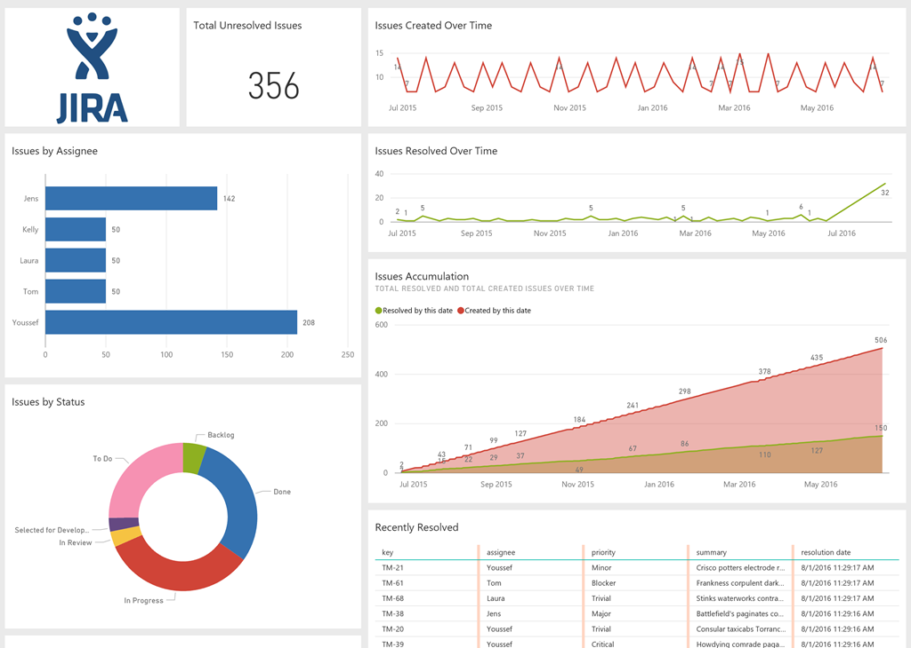

# Visualize JIRA Data in PowerBI

## Table of Contents
1. [Create API Token](#1-create-api-token)
2. [Configure PowerBI Desktop](#2-configure-powerbi-desktop)
3. [Custom Dashboards](#3-custom-dashboards)
    - [JQL Query](#jql-query)

## How to Use

The JIRA content pack in Power BI relies on the JIRA API. The Power BI team originally shared the [JIRA content pack](https://powerbi.microsoft.com/en-us/blog/explore-your-jira-data-with-power-bi/) in a blog post which was later removed. Below are the steps to use the provided .pbit file.

### 1. Create API Token

1. Navigate to the API Token page in your Atlassian account settings: [API Token page](https://id.atlassian.com/manage/api-tokens)
    - Log in to your Atlassian account.
    - Navigate to `Account settings > Security`.
    - Under API Token, click on 'Create and manage API tokens'.
2. Click the "Create API Token" button and enter a name of your choice, like "PowerBI", then click Create.
3. Copy the token to your clipboard using the "Copy" button.
   > **Note:** You will not be able to see the token again. Make sure to store the token somewhere safe.

### 2. Configure PowerBI Desktop

1. Download the [Original_Jira_PowerBI_ContentPack.pbit](./Original_Jira_PowerBI_ContentPack.pbit) PowerBI template and double-click to open it.
2. Once the file is open, it will ask for your company's JIRA URL. For example:
    ```
    https://YourCompanyName.atlassian.net
    ```
3. Enter the URL and click **Load**.
4. After a few seconds of processing, you will be asked to enter your credentials.
    - Choose "Basic" on the left sidebar.
    - Enter your "**Email Address**" in the "User name" field and the "**API Token**" copied from [Step 1](#1-create-api-token) in the "password" field.
5. Click connect or press enter.
6. The dashboard will start populating the content in visuals in the ContentPack template.

### 3. Custom Dashboards

#### JQL Query
- You can create custom dashboards by utilizing JQL (JIRA Query Language) queries to fetch specific data as per your requirements.

## Sample Screenshot


This guide helps you connect your JIRA data with PowerBI, creating powerful visualizations and insights into your project management activities. For further customization and advanced usage, refer to the JIRA API documentation [here](https://developer.atlassian.com/cloud/jira/platform/rest/v3/intro/).